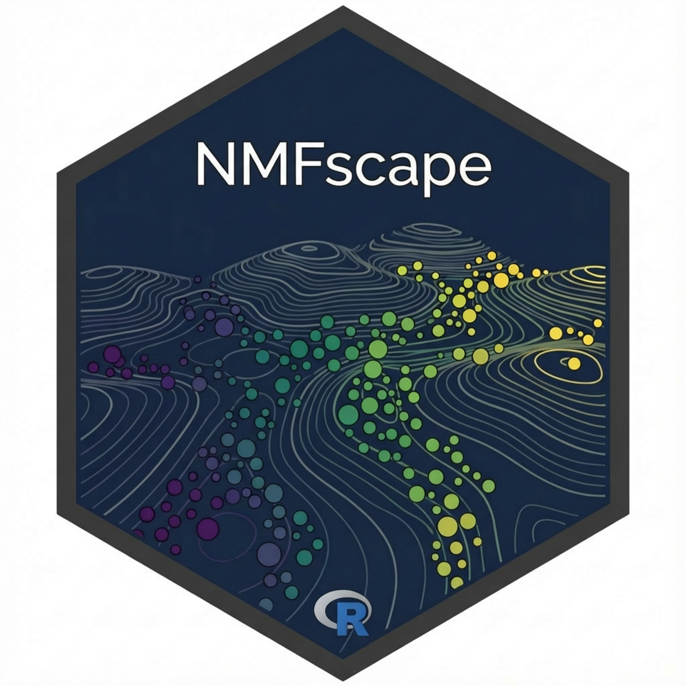

# NMFscape 

Fast Non-negative Matrix Factorization for Single Cell and Spatial Data using RcppML

## Overview

NMFscape provides high-performance non-negative matrix factorization (NMF) methods for SingleCellExperiment and SpatialExperiment objects. The package features:

- **Fast NMF**: Uses the RcppML backend for high-performance matrix factorization
- **Bioconductor Integration**: Seamless workflow with SingleCellExperiment and SpatialExperiment objects
- **Visualization Tools**: Comprehensive plotting functions for downstream analysis
- **Cell Type Analysis**: Differential program analysis for cell type mapping

## Features

### Core NMF Functions
- `runNMFscape()` - Fast NMF using RcppML backend
- Results stored in `reducedDims()` with basis in `metadata()`

## Installation

```r
# Install from GitHub
if (!requireNamespace("devtools", quietly = TRUE))
    install.packages("devtools")
devtools::install_github("MicTott/NMFscape")

# Load package
library(NMFscape)
```

## Requirements

- R (>= 4.3.0)
- Bioconductor packages: SingleCellExperiment, SummarizedExperiment
- RcppML for fast NMF computation (CRAN v0.3.7)
- ggplot2 for visualization (suggested)

## Citation

If you use NMFscape in your research, please cite:

- RcppML: DeBruine et al. (2021) "High-performance non-negative matrix factorization for large single cell data"

## License

This package is licensed under the Artistic-2.0 license.

## Issues

Please report issues on [GitHub Issues](https://github.com/MicTott/NMFscape/issues).