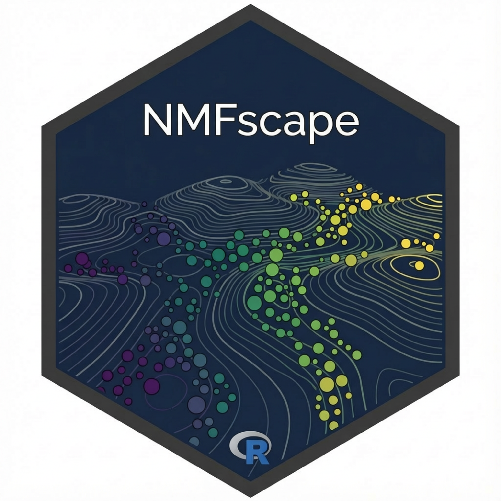

# NMFscape 

Fast Non-negative Matrix Factorization for Single Cell and Spatial Data using RcppML

## Overview

NMFscape provides high-performance non-negative matrix factorization (NMF) methods for SingleCellExperiment and SpatialExperiment objects. The package features:

- **Fast NMF**: Uses the RcppML backend for high-performance matrix factorization
- **Bioconductor Integration**: Seamless workflow with SingleCellExperiment and SpatialExperiment objects
- **Visualization Tools**: Comprehensive plotting functions for downstream analysis
- **Cell Type Analysis**: Differential program analysis for cell type mapping

## Features

### Core NMF
- `runNMFscape()` - fast NMF via the RcppML backend, with L1/L2 penalties and
  all six RcppML loss distributions (`mse`, `gp`, `nb`, `gamma`,
  `inverse_gaussian`, `tweedie`, or `"auto"` to pick one by BIC)
- `consensusNMF()` - consensus NMF across replicates with a cophenetic
  stability score
- Results stored in `reducedDims()`, with the basis and the raw RcppML model
  in `metadata()`

### Choosing k and diagnostics
- `selectRank()` / `plotRankSelection()` - held-out cross-validation for k
- `selectDistribution()` - compare loss functions and pick one by BIC or AIC
- `evaluateNMF()` - reconstruction loss for a fitted model
- `assessNMF()` - embedding quality against known labels (ARI, NMI,
  silhouette, cross-validated classification)

### Transfer learning
- `predictNMF()` - project new data onto an existing model, aligning features
- `refineNMF()` - label-guided refinement, optionally batch-corrected

### Multi-layer and multi-modal (RcppML FactorNet)
- `runMultiModalNMF()` - joint factorization across modalities (assays or
  altExps) through a shared cell embedding
- `runConditionedNMF()` - factor out a batch or covariate during factorization
- `runFactorNet()` - store a custom FactorNet graph in NMFscape slots

### Accessors and visualization
- `getBasis()`, `getCoefficients()`, `getTopFeatures()`, `getModel()`,
  `getDiagonal()`, `reconstructNMF()`
- `plotProgramHeatmap()`, `plotProgramDots()`, `vizDimRed()`, `vizUMAP()`
- `FindAllDEPs()`, `plotDEPsVolcano()`, `plotDEPsHeatmap()` for differential
  program analysis

## Installation

```r
# Install from GitHub
if (!requireNamespace("devtools", quietly = TRUE))
    install.packages("devtools")
devtools::install_github("MicTott/NMFscape")

# Load package
library(NMFscape)
```

## Requirements

- R (>= 4.4.0)
- Bioconductor: SingleCellExperiment, SpatialExperiment, SummarizedExperiment,
  S4Vectors, BiocGenerics, scran
- RcppML (>= 1.0.0) for the NMF backend
- ggplot2 (>= 3.4.0), pals, grDevices for visualization

Note that RcppML 1.0.0 introduced an S4 `nmf` class and the three-factor
decomposition `A = W %*% diag(d) %*% H`. Access results through
`getBasis()` / `getCoefficients()` rather than `$w` / `$h`.

## Citation

If you use NMFscape in your research, please cite:

- RcppML: DeBruine et al. (2021) "High-performance non-negative matrix factorization for large single cell data"

## License

This package is licensed under the Artistic-2.0 license.

## Issues

Please report issues on [GitHub Issues](https://github.com/MicTott/NMFscape/issues).